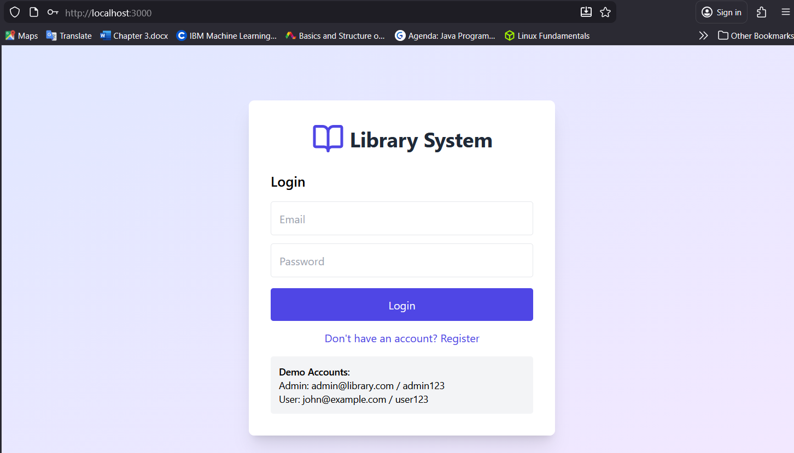
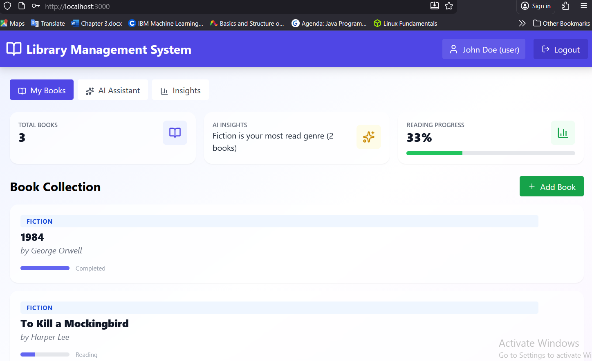
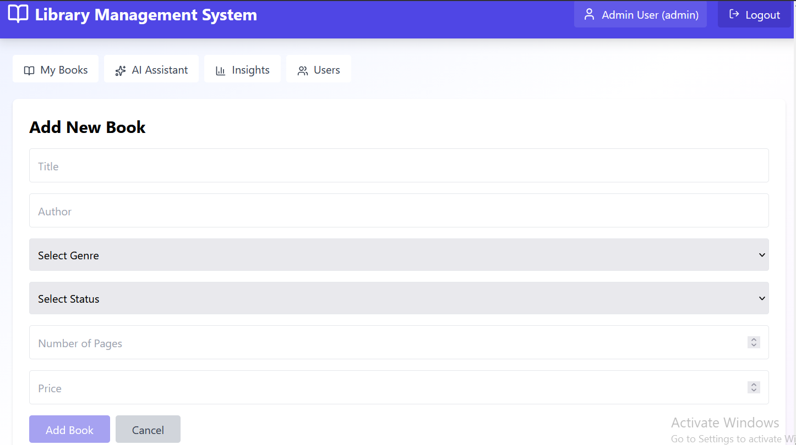
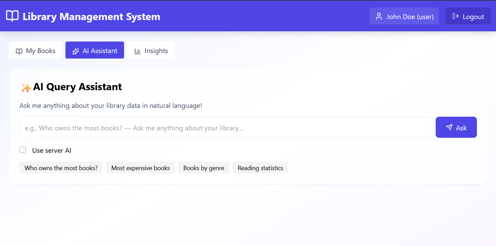
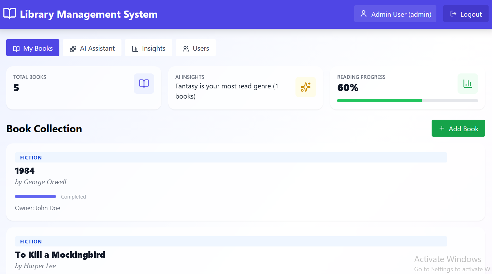

# 📚 Library Management System

A full-stack library management application with AI-powered features including natural language queries, smart recommendations, and automated insights generation.


## 🌟 Features

### Core Features
- ✅ **User Authentication** - Secure JWT-based authentication with role-based access control
- 📖 **Book Management** - Complete CRUD operations for personal library
- 🔍 **Smart Search** - Filter and search through your book collection
- 👥 **User Management** - Admin dashboard for managing users (admin only)
- 📊 **Reading Status Tracking** - Track books as "To Read", "Reading", or "Completed"

### AI-Powered Features
- 🤖 **Natural Language Queries** - Ask questions in plain English
  - "Who owns the most books?"
  - "Show me the five most expensive books"
  - "How many books are in the Fiction genre?"
- 💡 **Smart Recommendations** - AI-powered book recommendations based on your reading history
- 📈 **Automated Insights** - Real-time analytics and reading statistics

## 📸 Screenshots

### Login Page


### Dashboard


### Add Book Form


### AI Query


### Insights


### Admin Dashboard


## 🛠️ Technology Stack

### Frontend
- **React 18** - Modern UI with functional components and hooks
- **Tailwind CSS** - Utility-first styling
- **Lucide React** - Beautiful icon library
- **Axios** - HTTP client for API communication

### Backend
- **Node.js** - JavaScript runtime
- **Express.js** - Web application framework
- **MongoDB** - NoSQL database
- **Mongoose** - MongoDB ODM
- **JWT** - Secure token-based authentication
- **Bcrypt** - Password hashing

### Testing
- **Jest** - JavaScript testing framework
- **React Testing Library** - React component testing
- **Supertest** - HTTP integration testing

## 🚀 Quick Start

### Prerequisites
- Node.js 18+ installed
- MongoDB installed and running
- Git installed

### Installation

1. **Clone the repository**
```bash
git clone https://github.com/FatjonaGashi/library-management-system.git
cd library-management-system
```

2. **Set up Backend**
```bash
cd backend
npm install
cp .env.example .env
# Edit .env with your MongoDB URI and JWT secret
npm run dev
```

3. **Set up Frontend**
```bash
cd ../frontend
npm install
npm start
```

4. **Access the application**
- Frontend: http://localhost:3000
- Backend API: http://localhost:5000

## 👤 Demo Accounts

### Admin Account
- **Email:** admin@library.com
- **Password:** admin123
- **Access:** Full system access, user management

### User Account
- **Email:** john@example.com
- **Password:** user123
- **Access:** Personal library management

## 📁 Project Structure

```
library-management-system/
├── frontend/
│   ├── src/
│   │   ├── components/     # React components
│   │   ├── services/       # API services
│   │   ├── ai-utils.js     # AI processing utilities
│   │   └── App.js          # Main application
│   └── package.json
├── backend/
│   ├── models/             # MongoDB models
│   ├── routes/             # API routes
│   ├── middleware/         # Custom middleware
│   ├── __tests__/          # Test files
│   ├── server.js           # Express server
│   └── package.json
├── screenshots/            # Application screenshots
├── README.md
├── LICENSE
├── DEMO_GUIDE.md
└── .gitignore
```

## 🧪 Testing

```bash
# Run backend tests
cd backend
npm test

# Run frontend tests
cd frontend
npm test

# Run with coverage
npm test -- --coverage
```

## 🔐 Security Features

- JWT token-based authentication
- Password hashing with bcrypt (10 rounds)
- Role-based access control (RBAC)
- Protected API routes with middleware
- Input validation and sanitization
- CORS configuration for secure cross-origin requests

## 🎯 AI Features Implementation

### Natural Language Query Processing
The system uses a custom NLP parser that:
1. **Tokenizes** user queries into meaningful components
2. **Identifies** query intent (count, search, compare, filter)
3. **Extracts** relevant entities (books, genres, authors, users)
4. **Executes** appropriate MongoDB queries
5. **Formats** results in a user-friendly manner

### Recommendation Engine
Uses collaborative filtering and content-based algorithms:
- Analyzes user reading patterns
- Identifies genre preferences
- Suggests similar books based on completed reads
- Considers reading completion rates
- Provides personalized recommendations

### Insights Generation
Automated analytics that provide:
- Total book counts and categorization
- Reading progress statistics
- Genre distribution analysis
- Most active readers (admin view)
- Price analytics and budget tracking

## 📝 API Documentation

### Authentication Endpoints
```
POST /api/auth/register    - Register new user
POST /api/auth/login       - User login
GET  /api/auth/me          - Get current user
```

### Book Endpoints
```
GET    /api/books          - Get user's books
POST   /api/books          - Add new book
GET    /api/books/:id      - Get single book
PUT    /api/books/:id      - Update book
DELETE /api/books/:id      - Delete book
```

### AI Endpoints
```
POST /api/ai/query              - Natural language query
GET  /api/ai/recommendations    - Get personalized recommendations
GET  /api/ai/insights           - Get reading insights
```

### Admin Endpoints (Admin Only)
```
GET    /api/users          - Get all users
DELETE /api/users/:id      - Delete user
GET    /api/books/all      - Get all books (all users)
```
## 👩‍💻 Author

**Fatjona Gashi**
- Email: gashifatjona3@gmail.com
- LinkedIn: [Fatjona Gashi](https://www.linkedin.com/in/fatjona-gashi-8489431b8/)
---

**Made with ❤️ by Fatjona Gashi**